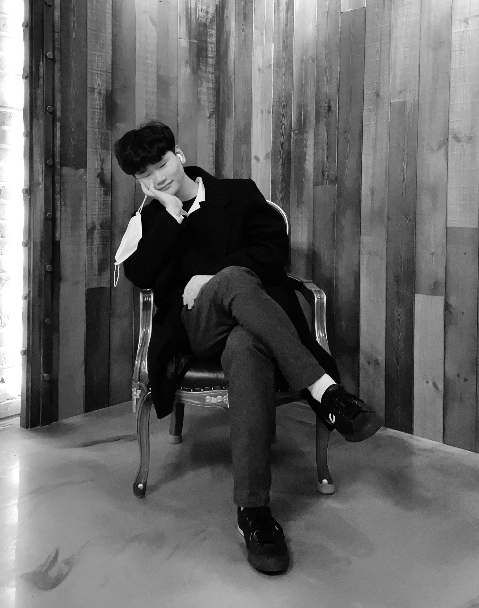

  

    
  

  

    <h1>이창현 (Changhyun Lee)</h1>
    
성균관대학교 산업공학과 품질공학연구실에서 AI와 데이터 기반 최적화를 통해 실제 산업 문제를 해결을 위해 연구하고 있습니다.

  

---

## 연구 관심 분야
- 이상탐지 및 공정 제어
- 오퍼레이션스 리서치 및 최적화
- 제조 분야의 언어 모델 응용

## 학력
**성균관대학교**
*산업공학과 석사 과정* | 2024.03 - 현재

**울산대학교**
*IT융합학부 학사* | 2018.03 - 2024.02

## 기술 스택
- **프로그래밍 언어**: Python
- **라이브러리 및 프레임워크**: PyTorch, Scikit-learn, Pandas, NumPy
- **전문 분야**: 이상탐지, 데이터 증강, LLM 응용, 시계열 분석

## 연구 및 프로젝트

### 석사 과정 연구 (성균관대학교)

- **OHT 가이드 휠 이상탐지**
  - 생성형 AI를 활용하여 데이터 부족 문제를 극복하고, 반도체 운송 시스템(OHT)의 결함을 탐지하는 딥러닝 모델을 개발했습니다.

- **LLM 기반 제조 공정 최적화**
  - 거대 언어 모델(LLM)을 사용하여 제조 데이터로부터 최종 제품 품질을 예측하고 최적의 공정 경로를 추천하는 새로운 프레임워크를 연구했습니다.

### 학부 주요 프로젝트 (울산대학교)

- **이상탐지를 위한 가상 결함 생성**
  - 산업용 용접 검사 모델 훈련을 위한 데이터 증강 기술을 연구하고 개발했습니다.

- **LLM 기반 여행 어드바이저 챗봇**
  - LLM(RAG) 기반의 챗봇을 개발하여 울산광역시의 여행지를 추천하는 시스템을 구축했습니다.

## 학술 활동
1. **Changhyun Lee**, Kangwoo Lee, Minji Kang, Donghee Lee, Jongseon Jeon. “Generative AI-based Data Augmentation Using Virtual Defect Patterns for OHT Guide Wheel Anomaly Detection”. *KIIE Spring Joint Conference*, 2025.
2. **Changhyun Lee**, Juhyun Kim, Sungjun Hur, Donghee Lee, Jongseon Jeon. “Defect Detection for OHT Wheels in Semiconductor Manufacturing Processes Using Generative AI-based Data Augmentation”. *INFORMS Annual Meeting*, 2024.
3. Yong-Deok Kim, Hangjun Cho, **Changhyun Lee**, Jaemin Cho. “A Study on the Machine Learning Model for the Financial Performance Prediction of Startups”. *APJCRI*, 2023.
4. **Changhyun Lee**, Seonyeong Kim, Gyunyub Kim, Heejin Yoo, Sudong Lee. “Development of Virtual Defect Generation Technique for Deep Learning-Based Detection of Welded Steel Pipe Non-Destructive Testing Image Flaws”. *KIIE Spring Conference*, 2023 (Poster Presentation).

## 경력
**연구원** | AleconoLab Inc. | 2022.09 - 2023.01  
**학부 연구생** | DaiS Lab, University of Ulsan | 2022.03 - 2024.02

## 수상 경력
- **대상(1st)**, 제4회 ICT 비즈니스 모델 아이디어 경진대회 (2023년 9월)
- **대상(1st)**, 공공빅데이터와 AI활용 경진대회(2023년 6월)
- **3위**, 현대중공업 DT 프로그램 (2022년 12월)  
- **금상**, U-Challenge Festival (2022년 11월)  

## 연락처
- **이메일**: [dns05018@g.skku.edu](mailto:dns05018@g.skku.edu)
- **GitHub**: [LHyunn](https://github.com/LHyunn)
